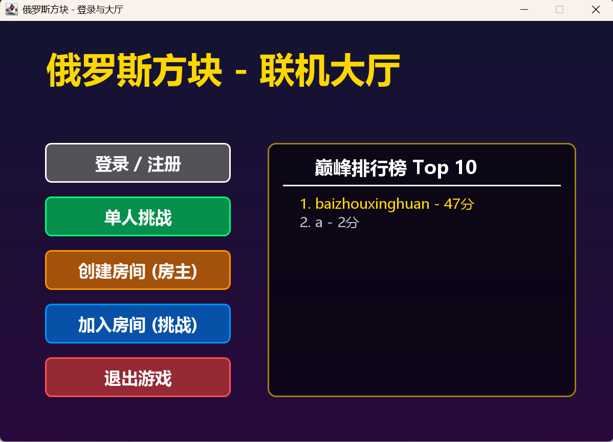
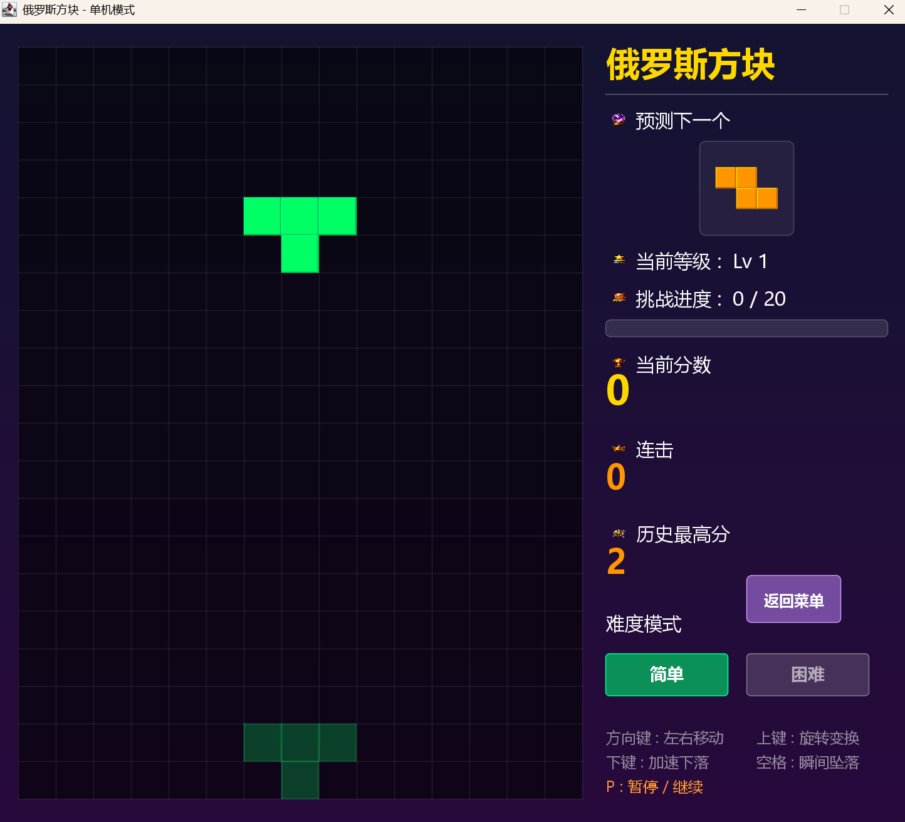
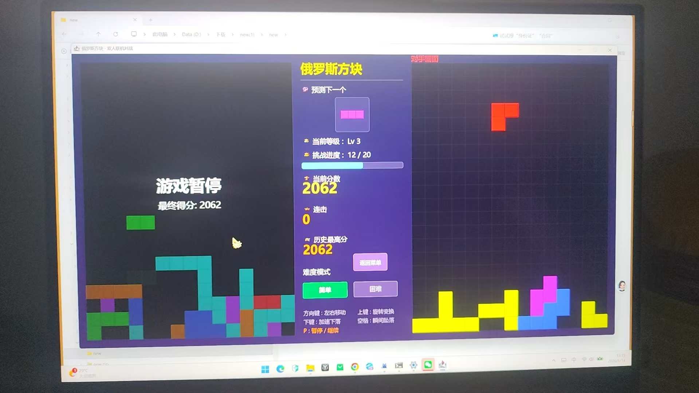
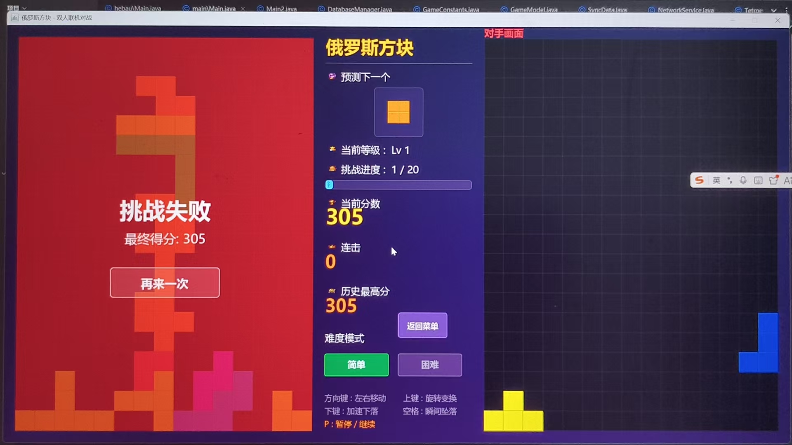

# 俄罗斯方块联机对战系统

一个基于 **纯 Java** 的俄罗斯方块游戏，支持 **局域网双人对战** 和 **互联网远程联机**（通过 WebSocket 中转服务器）。包含登录注册、SQLite 排行榜、背景音乐等完整功能。

---

## 项目结构

```
服务器 (2)/
├── 服务器/tetris-server/          # 中转服务器（WebSocket，纯 Java 零依赖）
│   ├── RelayServer.java              # 房间管理 + 游戏数据转发
│   ├── WebSocketUtil.java            # 服务端 WebSocket 工具
│   └── start.bat                     # 双击启动服务器
│
├── new/                              # 游戏客户端（Swing GUI）
│   ├── new/
│   │   ├── src/com/he/               # 主力版本（联机大厅版）
│   │   │   ├── config/GameConstants.java    # ★ 域名/端口/游戏参数配置
│   │   │   ├── controller/GameController.java
│   │   │   ├── model/GameModel.java
│   │   │   ├── network/NetworkService.java  # 网络服务（局域网+互联网）
│   │   │   ├── network/SyncData.java        # 游戏状态同步数据
│   │   │   ├── network/WebSocketUtil.java   # 客户端 WebSocket 工具
│   │   │   ├── service/DatabaseManager.java # SQLite 用户/排行榜
│   │   │   ├── view/StartMenu.java          # 登录大厅界面
│   │   │   ├── view/GameView.java
│   │   │   ├── view/GamePanel.java
│   │   │   └── ...
│   │   ├── src/com/hebau/            # 旧版（纯单机，无网络）
│   │   ├── lib/sqlite-jdbc-3.36.0.3.jar
│   │   ├── image/                    # UI 图标
│   │   └── music/                    # 音效 & BGM
│   └── start.bat                     # 双击启动客户端
│
├── docs/                             # 游戏截图目录（见下方展示）
├── README.md
├── LICENSE
└── .gitignore
```

---

## 快速开始

> 前置条件：安装 **JDK 17 或更高版本**（`java -version` 确认）

### 启动服务器（互联网联机才需要）

双击运行：
```
服务器/tetris-server/start.bat
```
服务器默认监听 **3202** 端口。

### 启动游戏客户端

双击运行：
```
new/start.bat
```

---

## 🎮 怎么玩

### 1. 单人挑战模式

1. 启动客户端后，先点击 **「登录 / 注册」** 创建账号
2. 登录后点击 **「单人挑战」**
3. 键盘操作：

| 按键 | 功能 |
|------|------|
| ← → | 左右移动方块 |
| ↑ | 旋转变换 |
| ↓ | 加速下落（软降） |
| 空格 | 瞬间坠落（硬降） |
| P | 暂停 / 继续 |

4. 消除 **20 行** 即获胜，分数会保存到本地 & 云端排行榜

### 2. 双人对战模式

#### 方式 A：🔧 局域网联机（无需互联网）

> 两台电脑连在同一个路由器/WiFi 下即可，**不需要启动中转服务器**。

**房主操作：**
1. 点击 **「创建房间 (房主)」**
2. 弹出对话框选择 **「局域网」**
3. 提示"等待对手连接..."，把你的 **局域网 IP** 告诉对方

**挑战者操作：**
1. 点击 **「加入房间 (挑战)」**
2. 弹出对话框选择 **「局域网」**
3. 输入房主的局域网 IP（如 `192.168.1.5`），点击确定
4. 双方游戏画面并排显示，实时对战！

> 💡 查看自己局域网 IP：命令行输入 `ipconfig`，找 `IPv4 地址`

#### 方式 B：🌐 互联网联机（需要公网服务器）

> 需要先部署中转服务器并通过 Cloudflare Tunnel 等工具暴露到公网。

1. 启动中转服务器
2. 配置域名（见下方 [改域名](#-改域名的地方)）
3. 房主点击「创建房间」→ 选择域名模式 → 输入房间名
4. 挑战者点击「加入房间」→ 选择域名模式 → 输入相同房间名
5. 服务器自动配对，开始对战

---

## 🌐 改域名的地方

> **只需要改 1 个文件！**

📁 **`new/new/src/com/he/config/GameConstants.java`** 第 26-27 行：

```java
public static final String SERVER_HOST = "example.com";  // ← 改成你的域名
public static final int SERVER_PORT = 443;                    // ← 改成你的端口（如果直连则改 3202）
```

**修改后重新运行 `new/start.bat` 即可生效。**

> ⚠️ 如果不使用互联网模式，只玩局域网对战，**无需修改任何代码**，也无需启动中转服务器。

---

## 📸 游戏截图

> 截图统一放在 `docs/` 目录下，请将你的游戏截图放入该文件夹后在下方替换路径。

### 主菜单（登录大厅）


### 单人模式


### 局域网对战 - 房主视角


### 局域网对战 - 双人对战


### 互联网模式 - 创建房间


### 游戏结束


---

## 排行榜

登录后，主菜单右侧会显示 **巅峰排行榜 Top 10**（基于 SQLite 数据库）。

数据存储在 `new/new/tetris_data.db`，排行榜刷新依赖 `DatabaseManager.java`。

---

## 环境要求

| 组件 | 要求 |
|------|------|
| JDK | **17+**（使用了增强型 switch、record 等语法） |
| 操作系统 | Windows / macOS / Linux（已提供 Windows bat 脚本） |
| 网络 | 局域网模式无需外网；互联网模式需要中转服务器 |

---

## LICENSE

本项目使用 **MIT License** 开源，详见 [LICENSE](LICENSE) 文件。