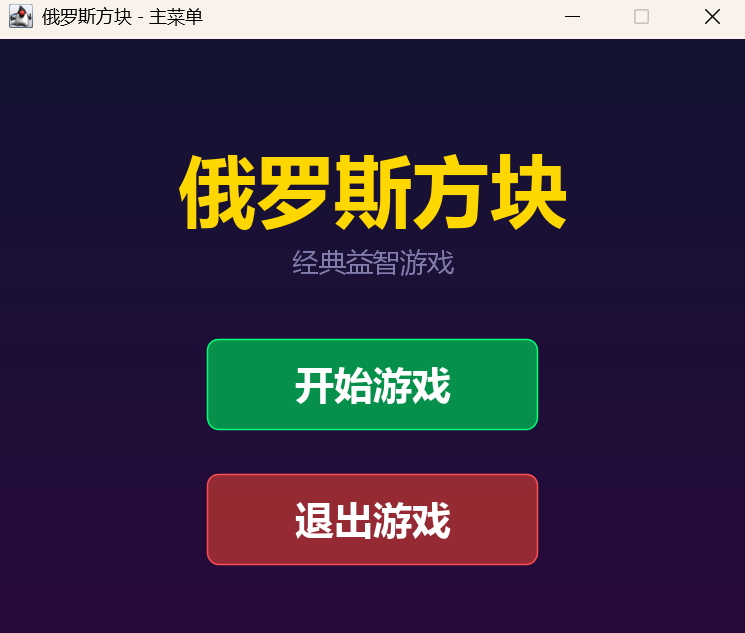
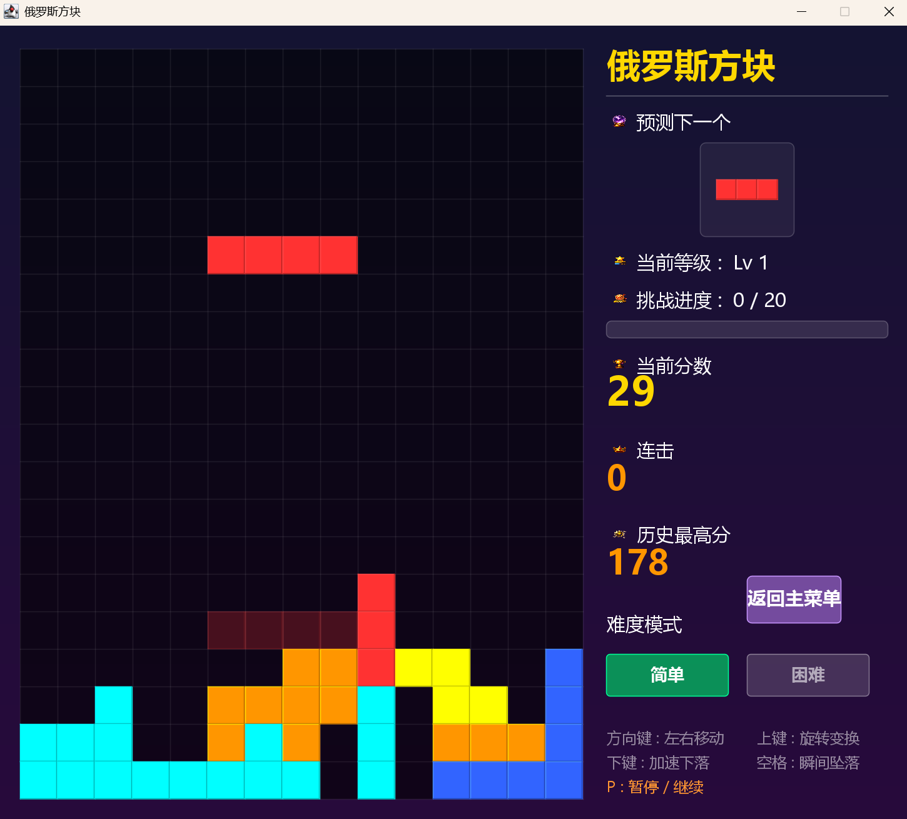
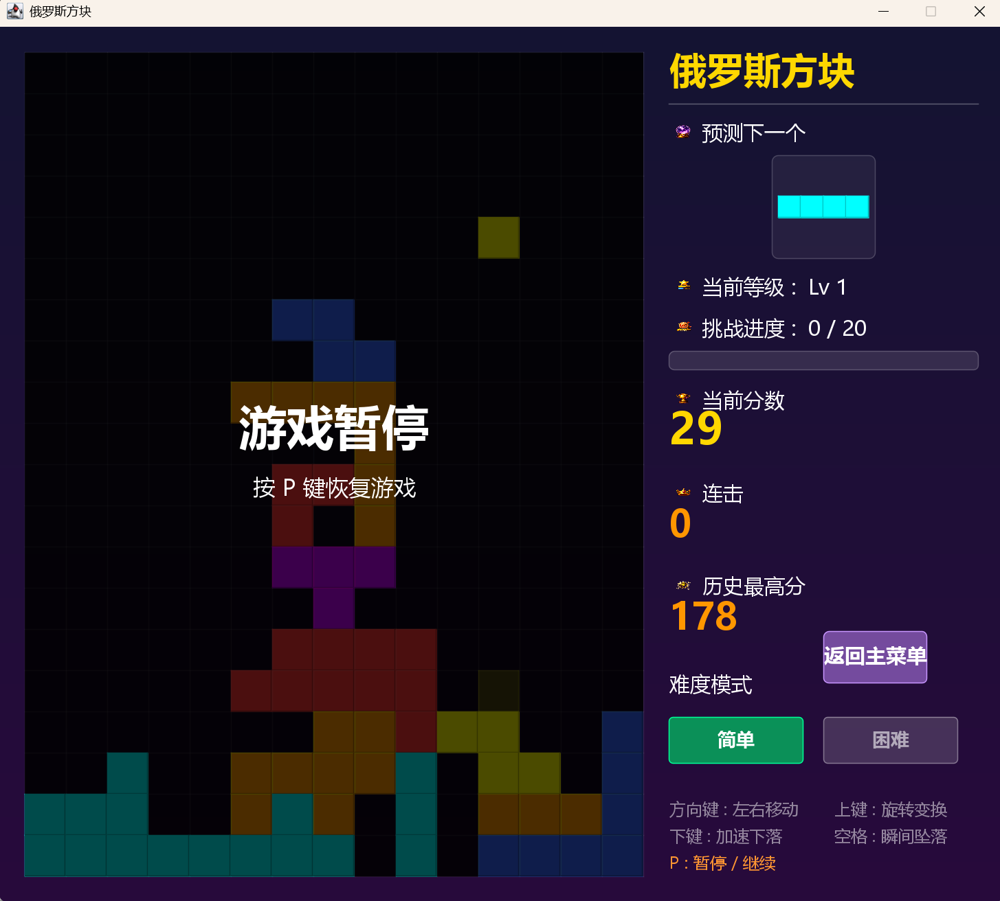
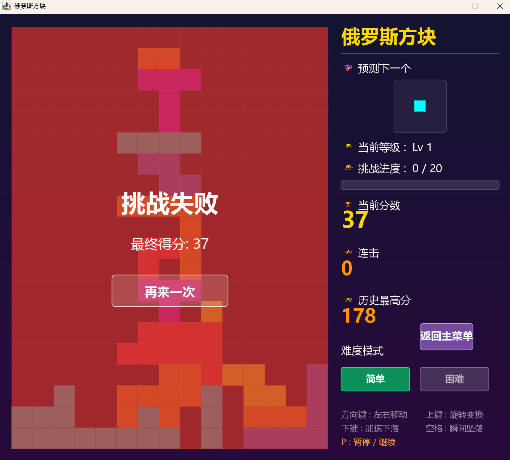
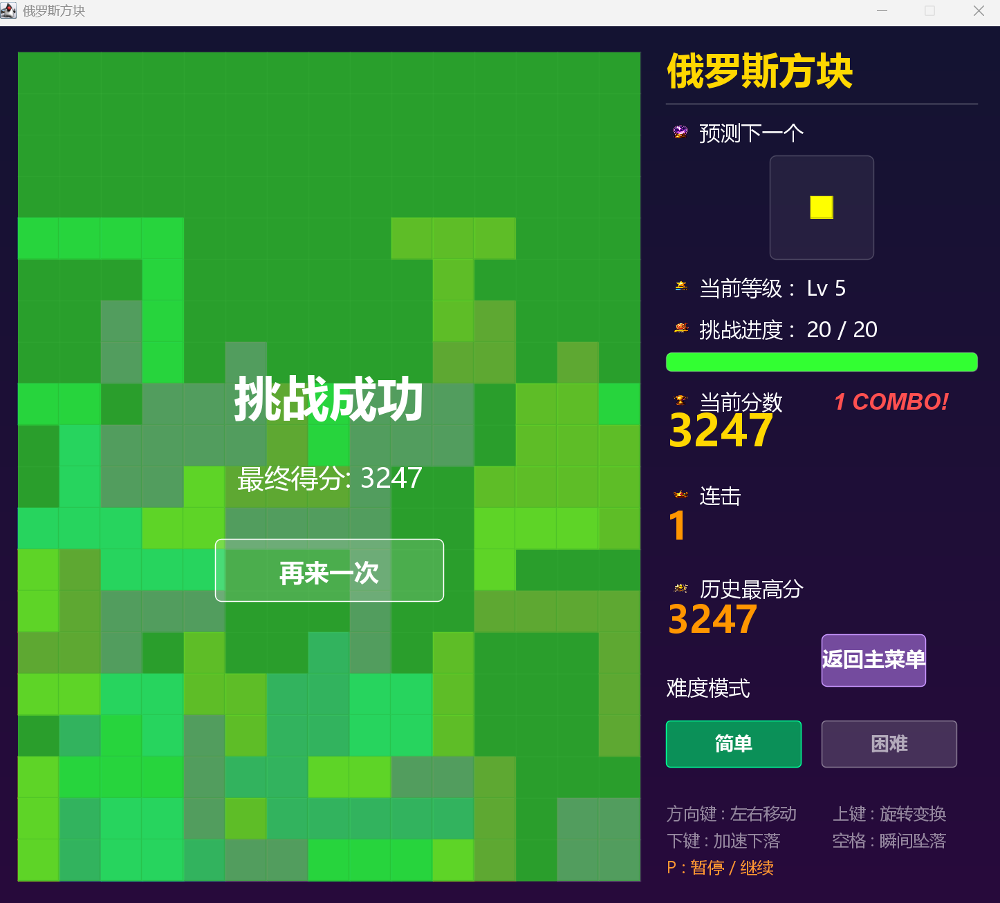

# 俄罗斯方块 (Tetris)


一个基于 **Java Swing** 开发的经典俄罗斯方块游戏。支持简单/困难双模式、音效反馈、最高分记录、连击系统等丰富功能。

---

## 📋 目录

- [游戏简介](#-游戏简介)
- [功能特性](#-功能特性)
- [环境要求](#-环境要求)
- [快速开始](#-快速开始)
- [操作说明](#-操作说明)
- [游戏规则](#-游戏规则)
- [项目结构](#-项目结构)
- [技术栈](#-技术栈)
- [开发指南](#-开发指南)
- [常见问题](#-常见问题)
- [许可证](#-许可证)

---

## 🎮 游戏简介

本项目是一款使用 Java 语言开发的俄罗斯方块游戏，采用 Swing 框架构建图形用户界面。游戏在经典俄罗斯方块玩法基础上，加入了**随机形状生成**、**双难度模式**、**连击计分**、**幽灵方块预览**、**背景音乐与音效**等特色功能，并提供**历史最高分持久化存储**。

游戏目标：在 20×15 的网格中，通过摆放和消除方块获得分数，消除 20 行即可获胜。

---

## ✨ 功能特性

### 🎯 核心玩法
- **经典俄罗斯方块玩法**：移动、旋转、下落方块，填满整行即可消除
- **随机形状生成**：通过递归算法动态生成 1~4 格的所有连通形状，每局方块形状不重复
- **幽灵方块**：显示当前方块落地的预览位置，辅助精准摆放
- **连击系统**：连续消除行数越多，连击加成越高（Combo 奖励）

### 🎚️ 双难度模式
| 模式 | 说明 |
|------|------|
| **简单模式** | 经典旋转方式，方块顺时针旋转 90° |
| **困难模式** | 随机变换形状，旋转后方块形状完全改变，增加不确定性 |

### 🎵 音效与音乐
- **背景音乐**：游戏过程中循环播放 BGM（WAV 格式）
- **操作音效**：移动、旋转、硬降等操作均有对应音效反馈
- **结局音效**：胜利/失败时播放不同音效

### 📊 计分与进度
- **计分规则**：消除 1 行 100 分，2 行 300 分，3 行 500 分，4 行 800 分
- **连击加成**：Combo 数 × 消除行数 × 50 额外加分
- **软降加分**：按住下键加速下落时，每格 +1 分
- **等级系统**：每消除 5 行升 1 级，下落速度随等级递增
- **进度条**：可视化显示当前消除进度（0/20 → 20/20）
- **最高分记录**：自动保存历史最高分至本地文件 `highscore.txt`

### 🖼️ 视觉体验
- 渐变背景与圆角按钮
- 彩色方块与高亮边框
- 侧边栏展示：下一个方块预览、等级、分数、连击、最高分
- 暂停/结束/胜利覆盖层提示

---

## 💻 环境要求

- **JDK 版本**：Java 17 或更高版本（推荐 Java 17+）
- **操作系统**：Windows / macOS / Linux（支持 Java 运行环境即可）
- **音频支持**：需系统支持 Java Sound API（WAV 格式播放）

---

## 🚀 快速开始

### 方式一：使用启动脚本（推荐）

```bash
# Windows 系统
双击 start.bat
```

`start.bat` 会自动编译所有 Java 源文件并启动游戏。

### 方式二：手动编译运行

```bash
# 1. 进入项目根目录
cd Tetris_game

# 2. 编译所有 Java 文件
javac -encoding UTF-8 com\game\*.java

# 3. 运行游戏
java com.game.Main
```

### 方式三：使用 IDE

1. 使用 IntelliJ IDEA / Eclipse / VS Code 打开项目根目录
2. 将 `com/game` 标记为源代码根目录
3. 运行 `com.game.Main` 类

---

## 🎮 操作说明

| 按键 | 功能 |
|------|------|
| ⬅️ **左方向键** | 方块左移 |
| ➡️ **右方向键** | 方块右移 |
| ⬇️ **下方向键** | 加速下落（软降） |
| ⬆️ **上方向键** | 旋转方块 / 随机变换形状 |
| **空格键** | 瞬间坠落（硬降） |
| **P 键** | 暂停 / 继续游戏 |

> **提示**：在游戏界面中，您还可以通过鼠标点击切换「简单/困难」难度模式。

---

## 📖 游戏规则

1. **游戏区域**：20 行 × 15 列的网格
2. **方块生成**：随机生成 1~4 格连通形状，从顶部中央出现
3. **方块移动**：使用方向键控制方块左右移动和旋转
4. **消除行**：当一行被方块完全填满时，该行被消除，上方所有行下移
5. **游戏结束**：新生成的方块无法放入有效位置时，游戏结束
6. **胜利条件**：累计消除 20 行即可获胜
7. **难度模式**：
   - **简单模式**：方块顺时针旋转 90°
   - **困难模式**：旋转时方块形状随机变化，增加不可预测性

---

## 游戏截图











## 📁 项目结构

```
Tetris_game/
├── start.bat              # Windows 启动脚本（编译+运行）
├── highscore.txt          # 最高分存档文件（自动生成）
├── README.md              # 项目说明文档
├── .gitignore             # Git 忽略规则
├── LICENSE                # 开源许可证
│
├── com/
│   ├── game/              # Java 源代码包
│   │   ├── Main.java      # 程序入口，启动主菜单
│   │   ├── StartMenu.java # 主菜单界面（标题、按钮、背景音乐）
│   │   ├── Game.java      # 游戏核心逻辑（网格、方块、计分、音效）
│   │   └── UI.java        # 游戏界面（渲染、键盘控制、侧边栏）
│   │
│   ├── image/             # 界面图标资源（PNG 格式）
│   │   ├── 1.png          # 预测下一个图标
│   │   ├── 2.png          # 当前等级图标
│   │   ├── 3.png          # 挑战进度图标
│   │   ├── 4.png          # 当前分数图标
│   │   ├── 5.png          # 连击图标
│   │   └── 6.png          # 历史最高分图标
│   │
│   └── music/             # 音频资源（WAV 格式）
│       ├── bgm.wav        # 背景音乐
│       ├── drop.wav       # 硬降音效
│       ├── lose.wav       # 失败音效
│       ├── move.wav       # 移动音效
│       ├── rotate.wav     # 旋转音效
│       └── win.wav        # 胜利音效
│
└── out/                   # 编译输出目录（编译后自动生成）
    └── ...
```

---

## 🛠️ 技术栈

| 技术 | 用途 |
|------|------|
| **Java 17+** | 编程语言 |
| **Java Swing** | 图形用户界面（JFrame, JPanel, Graphics2D） |
| **Java Sound API** | 音频播放（AudioSystem, Clip） |
| **Java AWT** | 事件处理（KeyAdapter, MouseAdapter） |
| **文件 I/O** | 最高分持久化存储（BufferedReader/BufferedWriter） |
| **递归算法** | 生成所有连通形状组合 |

### 核心算法亮点

- **形状生成**：使用深度优先搜索（DFS）递归生成 1~4 格的所有连通形状，并自动去重（含旋转对称）
- **幽灵方块**：通过逐行下移检测碰撞，计算方块落点预览位置
- **碰撞检测**：基于网格矩阵的边界与占用检测
- **连击计分**：连续消除行数越多，Combo 倍率越高

---

## 🔧 开发指南

### 如何修改游戏参数

在 `Game.java` 中可调整以下常量：

```java
private static final int WIN_LINES = 20;   // 胜利所需消除行数
private static final int ROWS = 20;        // 网格行数
private static final int COLS = 15;        // 网格列数
private long baseDropInterval = 550;       // 基础下落间隔（毫秒）
```

在 `UI.java` 中可调整界面参数：

```java
private static final int CS = 40;          // 方块像素大小
private static final int SW = 300;         // 侧边栏宽度
```

### 如何添加新的音效/图片

1. 将音频文件（WAV 格式）放入 `com/music/` 目录
2. 将图片文件（PNG 格式）放入 `com/image/` 目录
3. 在 `Game.java` 或 `UI.java` 中添加对应的加载和播放逻辑

### 构建可执行 JAR

```bash
# 编译所有类
javac -encoding UTF-8 -d out com/game/*.java

# 打包为 JAR（包含资源文件）
cd out
jar cfe Tetris.jar com.game.Main com/game/*.class ../com/image/* ../com/music/*
```

---

## ❓ 常见问题

### Q: 游戏无法启动？
- 确保已安装 JDK 17+，可通过 `java -version` 检查
- 确保在项目根目录下运行脚本或命令
- 检查 `com/game/` 目录下是否存在 `.java` 源文件

### Q: 没有声音？
- 确保系统音量已开启
- 检查 `com/music/` 目录下是否存在 WAV 文件
- 某些 Linux 系统可能需要额外安装音频支持

### Q: 中文显示乱码？
- 编译时使用 `-encoding UTF-8` 参数
- 确保终端/IDE 使用 UTF-8 编码

### Q: 最高分没有保存？
- 检查项目根目录是否有写入权限
- `highscore.txt` 文件会在首次破纪录时自动创建

---

## 📄 许可证

本项目基于 MIT 许可证开源。详见 [LICENSE](LICENSE) 文件。

---

## 🙏 致谢

- 经典俄罗斯方块游戏设计灵感来源于 Alexey Pajitnov
